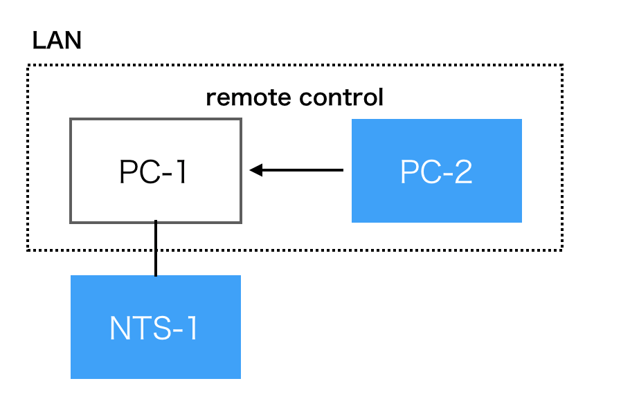

# NTS-1 Web Controller

Control your KORG Nu:Tekt NTS-1 digitak kit from web browser.


## Features

* Browser-controlled UI for KORG NTS-1 synthesizer

* Virtual keyboard

* Patches stored in LocalStorage

## Browser Support

This app works in all browsers that natively support the [Web MIDI API](https://www.w3.org/TR/webmidi/). Currently, the following browsers have built-in support:

* Chrome (Mac, GNU/Linux, Android & Windows)

* Opera (Mac, GNU/Linux, Windows)

* Android WebView component (KitKat and above)

## Demo

Connect Korg NTS-1 to your PC through USB port, and access this URL with Chrome (or Chromium).
[https://directions4.github.io/nts1-web-controller/](https://directions4.github.io/nts1-web-controller/)

## Local execution

### Installation

You need [node](https://nodejs.org/) and [yarn](https://yarnpkg.com/).

```sh
yarn install
```

### Running

```sh
yarn serve
```

access [http://localhost:8080/](http://localhost:8080/) .



access [http://YOUR_HOST_IP:3000/](http://YOUR_HOST_IP:3000/).

## License

NTS-1 Web Controller is licensed under a [MIT License](./LICENSE).
