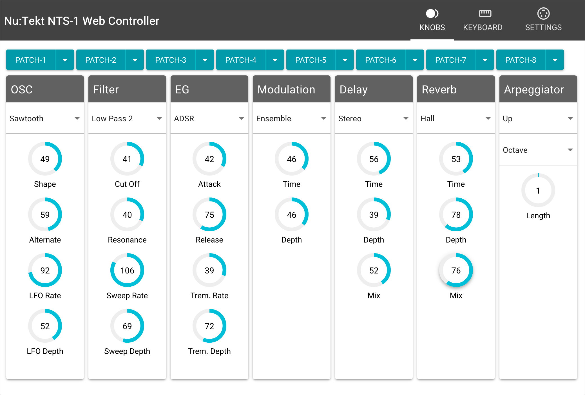

# NTS-1 Web Controller

You can control the KORG Nu:Tekt NTS-1 from your web browser. It allows for real-time sound editing and also features librarian functionality.

You can also install it on your own machine, but it also runs at the following URL.

[https://directions4.github.io/nts1-web-controller/](https://directions4.github.io/nts1-web-controller/)



## Features

* **Browser-controlled UI** for KORG NTS-1 synthesizer
* **Real-time parameter control** with virtual knobs and sliders
* **Virtual keyboard** with octave shifting and hold/arpeggiator modes
* **Patch management** with save/load functionality stored in Web LocalStorage
* **MIDI device monitoring** with connection status indicators

## Browser Support

This app works in all browsers that natively support the [Web MIDI API](https://www.w3.org/TR/webmidi/). Currently, the following browsers have built-in support:

* Chrome (Mac, GNU/Linux, Android & Windows)

* Firefox (Mac, GNU/Linux, Android & Windows)

* Android WebView component (KitKat and above)

## Demo

Connect Korg NTS-1 to your PC or SmartPhone through USB port, and access this URL with Chrome (or Chromium).
[https://directions4.github.io/nts1-web-controller/](https://directions4.github.io/nts1-web-controller/)

## Local execution

### Prerequisites

You need [Node.js](https://nodejs.org/) (version 16 or higher).

### Installation

```sh
npm install
```

### Development

```sh
npm run dev
```

Access [http://localhost:5173/](http://localhost:5173/) in your browser.

### Building

```sh
npm run build
```

### Testing

Run unit tests:

```sh
npm run test:unit
```

Run type checking:

```sh
npm run type-check
```

Run linting:

```sh
npm run lint
```

## Development

### Architecture

- **Vue 3** with Composition API and `<script setup>` syntax
- **Quasar Framework** for UI components and styling
- **WebMIDI.js** for MIDI communication with NTS-1 hardware
- **TypeScript** for type safety and enhanced development experience
- **Vite** as build tool
- **Vitest** for unit testing

### Project Structure

```
src/
├── components/           # Vue components
│   ├── Main.vue         # Main controller interface
│   ├── Knob.vue         # Reusable knob control
│   ├── Keyboard.vue     # Virtual MIDI keyboard
│   ├── StoreButton.vue  # Patch save/load buttons
│   └── __tests__/       # Component unit tests
├── lib/
│   ├── params.ts        # NTS-1 MIDI parameter mappings
│   └── utils.ts         # Utility functions
├── types/
│   └── components.ts    # TypeScript type definitions
└── App.vue              # Root application component
```

## License

NTS-1 Web Controller is licensed under a [MIT License](./LICENSE).
